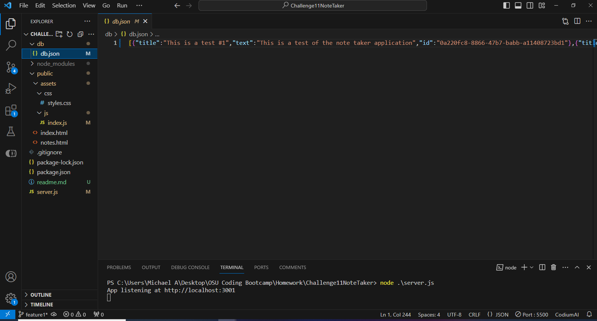
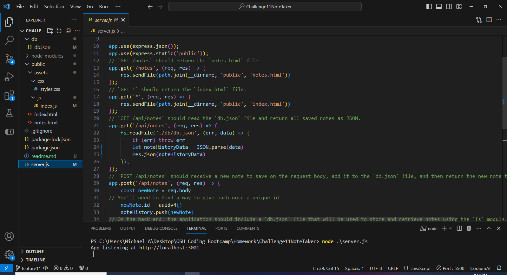
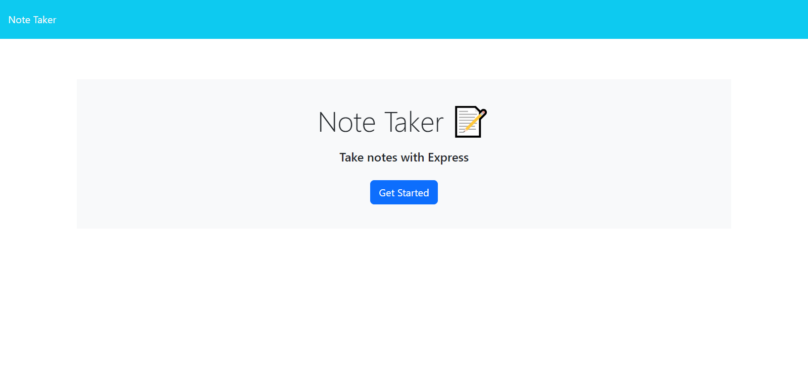
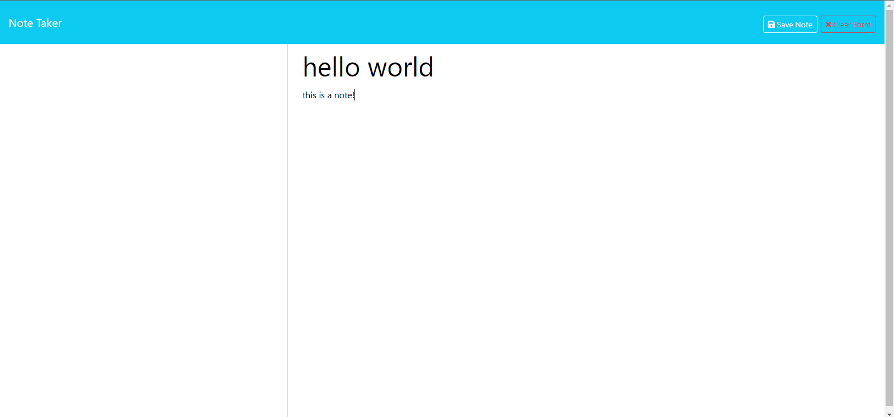

# Challenge11NoteTaker

## Table of Contents
1. [Description](#description)
2. [Installation](#installation)
3. [Usage](#usage)
4. [License](#license)
5. [Site and Repository Addresses](#site%20and%20repository%20addresses)
6. [Questions](#questions)

## Description
An application that can be used to write and save notes

## Installation
You must have Node.js downloaded, with “express” listed under dependencies in a package.json file, and a node_modules file. Both the package.json and the node_modules must be in the same folder as the source.js.

## Usage
   t 

## License
MIT License

## Site and Repository Addresses
https://github.com/MArrasmith/Challenge11NoteTaker

https://challenge11notetaker-273431cf9206.herokuapp.com/

## Questions
If you have any questions regarding this project, please reach out via GitHub or contact via email.
[https://github.com/MArrasmith]
Email Address - michael.keith.arrasmith@gmail.com
  
